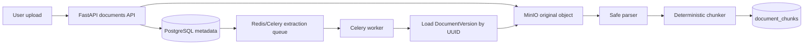
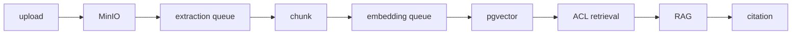

# SecureDocs AI Hub Architecture

## Phase A implemented flow

The extraction task payload contains only `document_version_id` as a string. The worker resolves the version row, checks document deletion/status, reads the original object through DB-owned `storage_key`, extracts text, and replaces chunks idempotently in the success transaction.

## Future MVP flow

Phase B will add embedding providers and ACL-filtered vector search. Phase C will add RAG, classification, recommendations, comments, and backup workflows.
