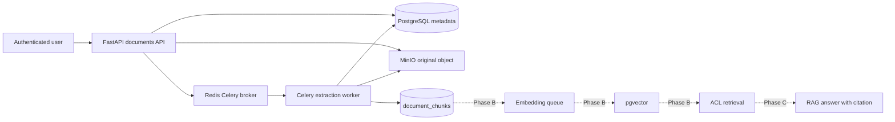

# Architecture

## Phase A implemented flow

The extraction task payload contains only `document_version_id` as a string. The worker resolves the version row, checks document deletion/status, reads the original object through DB-owned `storage_key`, extracts text, and replaces chunks idempotently in the success transaction.

External HTTP traffic enters through Nginx at `http://localhost`. Backend and frontend ports are internal Compose ports by default. Backend, worker, and backend-test containers use Docker service names (`postgres`, `redis`, `minio`) rather than `localhost` for infrastructure dependencies.

## Container path contract

- Host repository root: project checkout directory.
- Backend/worker runtime workdir: `/workspace/backend`.
- Backend test workdir: `/workspace/backend`.
- Host test path example: `backend/tests/test_extraction_static.py`.
- Container pytest path example: `tests/test_extraction_static.py`.

## Not implemented yet

Embedding providers, pgvector search, RAG chat, document classification, recommendations, comments, and backup orchestration are Phase B/C work and are intentionally outside Phase A stabilization.
